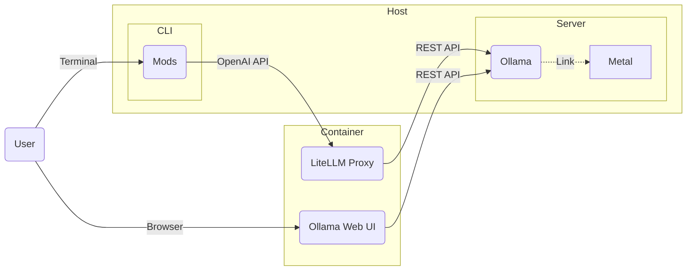

# OllamaStack

Setup [Ollama](https://github.com/jmorganca/ollama) stack on macOS.

- [OllamaStack](#ollamastack)
  - [Prerequisites](#prerequisites)
  - [Diagram](#diagram)
  - [Quickstart](#quickstart)
    - [Demo](#demo)

## Prerequisites
* A [Metal capable](https://support.apple.com/en-us/102894) Mac device.
* [Mods](https://github.com/charmbracelet/mods): AI for the command line, built for pipelines.
* [Docker](https://www.docker.com/products/docker-desktop): The fastest way to containerize applications.

## Diagram



## Quickstart

```bash
$ git clone https://github.com/yeahdongcn/OllamaStack.git
$ cd OllamaStack
$ ./start.sh
$ ./stop.sh
```

### Demo


